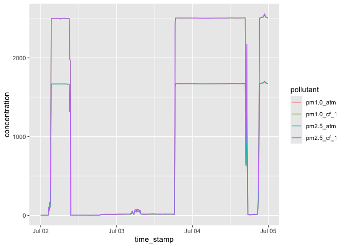

<!-- README.md is generated from README.Rmd. Please edit that file -->

# PurpleAir

<!-- badges: start -->

[](https://lifecycle.r-lib.org/articles/stages.html#experimental)
[](https://CRAN.R-project.org/package=PurpleAir)
[](https://github.com/cole-brokamp/PurpleAir/actions/workflows/R-CMD-check.yaml)
<!-- badges: end -->

The goal of PurpleAir is to provide read access to the [PurpleAir
API](https://api.purpleair.com/) to retrieve real-time and historical
data from PurpleAir sensors.

Please note that usage of this package must abide by the requirements of
the PurpleAir API. From their website:

> PurpleAir was founded on principles of openness, sharing, and
> community. It is to strengthen these principles and ensure the success
> of our entire community that we put together updated [terms of
> service](https://www.purpleair.com/terms), [data
> license](https://www.purpleair.com/license), and [data
> attribution](https://www.purpleair.com/attribution) requirements when
> using PurpleAir data and this API. Please take a moment to review them
> and note the attribution guide and data license agreement. If you have
> any questions or need more information, we have an excellent resource
> at <https://community.purpleair.com/c/data/api/>.

## Installation

Install the development version of PurpleAir with:

``` r
pak::pak("cole-brokamp/PurpleAir")
```

## Usage

``` r
library(PurpleAir)
```

Querying data from the PurpleAir API requires a free [PurpleAir
Developer API
key](https://develop.purpleair.com/sign-in?redirectURL=%2Fdashboards%2Fkeys)
linked to a Google account. Functions in the package each take a
`purple_air_api_key` argument or your key can be stored in an
environment variable called `PURPLE_AIR_API_KEY`). To check your key,
use:

``` r
check_api_key(Sys.getenv("PURPLE_AIR_API_KEY"))
#> ✔ Using valid 'READ' key with version V1.0.14-0.0.57 of the PurpleAir API on 2024-07-06 00:13:55
```

Get the latest data from a single PurpleAir sensor, defined by its
[sensor key](https://community.purpleair.com/t/sensor-index/4000):

``` r
get_sensor_data(sensor_index = 175413,
                fields = c("name", "last_seen", "pm2.5_cf_1", "pm2.5_atm"))
#> $last_seen
#> [1] "2024-07-06 00:13:48 EDT"
#> 
#> $name
#> [1] "JN-Clifton,OH"
#> 
#> $pm2.5_atm
#> [1] 22.4
#> 
#> $pm2.5_cf_1
#> [1] 22.4
```

Get the latest data from many PurpleAir sensors, defined by their sensor
keys,

``` r
get_sensors_data(x = as.integer(c(175257, 175413)),
                 fields = c("name", "last_seen", "pm2.5_cf_1", "pm2.5_atm"))
#> # A tibble: 2 × 5
#>   sensor_index last_seen           name          pm2.5_atm pm2.5_cf_1
#>          <int> <dttm>              <chr>             <dbl>      <dbl>
#> 1       175257 2024-07-06 00:12:06 Lillard            25.8       25.8
#> 2       175413 2024-07-06 00:11:48 JN-Clifton,OH      23.3       23.3
```

a geographic bounding box,

or a date from which sensors must have been modified since.

Get the latest data from several PurpleAir sensors:

Get historical data from a single PurpleAir sensor:

``` r
my_history <-
  get_sensor_history(
    sensor_index = 175413,
    fields = c("pm1.0_cf_1", "pm1.0_atm", "pm2.5_cf_1", "pm2.5_atm"),
    start_timestamp = as.POSIXct("2024-07-02"),
    end_timestamp = as.POSIXct("2024-07-05")
  )

my_history
#> # A tibble: 432 × 5
#>    time_stamp          pm1.0_cf_1 pm1.0_atm pm2.5_atm pm2.5_cf_1
#>    <dttm>                   <dbl>     <dbl>     <dbl>      <dbl>
#>  1 2024-07-04 22:30:00    2522.     1683.     1689.      2530.  
#>  2 2024-07-04 23:00:00    2530.     1687.     1695.      2541.  
#>  3 2024-07-04 07:20:00    2503.     1670.     1671.      2504.  
#>  4 2024-07-04 13:10:00    2505.     1672.     1674.      2507.  
#>  5 2024-07-04 19:50:00       9.73      9.73     12.1       12.1 
#>  6 2024-07-04 13:50:00    2504.     1671.     1673.      2506.  
#>  7 2024-07-03 21:00:00    2504.     1671.     1672.      2505.  
#>  8 2024-07-02 07:00:00    2501.     1668.     1669.      2502.  
#>  9 2024-07-02 16:10:00       1.62      1.62      1.94       1.94
#> 10 2024-07-03 10:20:00      14.6      14.6      17.4       17.4 
#> # ℹ 422 more rows
```

and plot it:

``` r
my_history |>
  tidyr::pivot_longer(cols = tidyr::starts_with("pm"), names_to = "pollutant", values_to = "concentration") |>
  ggplot2::ggplot(ggplot2::aes(time_stamp, concentration, color = pollutant)) +
  ggplot2::geom_line()
```


